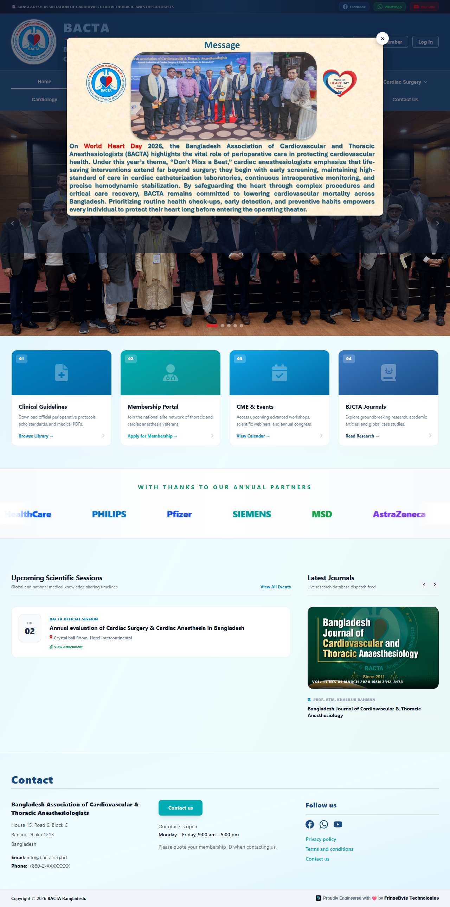
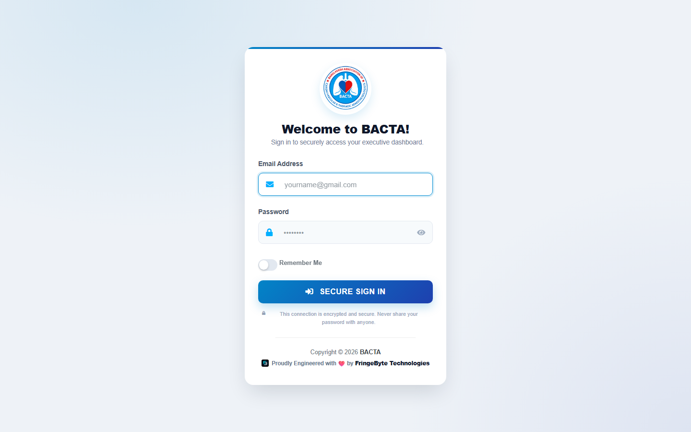

# BACTA — Bangladesh Association of Cardiovascular & Thoracic Anesthesiologists

Official web platform and administration system for **BACTA**, the national professional body for cardiovascular and thoracic anesthesiologists in Bangladesh. The platform serves as the association's public-facing website and a full membership/content management system for its executive committee.


---

## Screenshots

<table>
  <tr>
    <td width="60%"></td>
    <td width="40%"></td>
  </tr>
  <tr>
    <td align="center"><sub>Public homepage</sub></td>
    <td align="center"><sub>Admin sign-in</sub></td>
  </tr>
</table>

---

## What it does

- **Public website** — association info, executive committee, membership tiers, event calendar, media gallery, BJCTA academic journal archive, clinical guidelines library, and a contact/secretariat inbox.
- **Membership pipeline** — visitors submit a membership application (no account created); the secretariat reviews and approves/rejects it, then manually provisions a login for approved members from the admin panel.
- **Admin panel** — a full back office (AdminLTE-based) for managing every piece of public content, plus a national surgical statistics registry (overall, congenital, and valvular procedure counts per hospital per year).
- **Homepage popup banner** — admins can upload/replace/schedule a promotional popup shown on the homepage, without touching any code.

## Core modules

| Module | What it covers |
|---|---|
| Governance & Membership | Executive committee directory, lifetime fellows, active members, membership applications |
| News & Publications | Announcements, executive minutes, events & seminars, media gallery, BJCTA journals, clinical guidelines, secretariat inbox |
| National Surgical Hub | Cardiac / congenital / valvular surgery statistics by hospital and year |
| Homepage Popup | Admin-managed promotional banner shown on the public homepage |
| Admin & Staff Directory | Role-gated staff accounts, provisioned only by existing admins |

## Security

- Role-gated admin middleware on every back-office route, with the primary administrator account additionally protected from edit/deletion by any other admin
- Soft-deletes across all content tables — an accidental or malicious delete is recoverable, not permanent
- Automated encrypted database backups (`spatie/laravel-backup`), scheduled daily
- CSRF protection on every form, honeypot + rate-limiting on public-facing forms (contact, membership application)
- File uploads validated by real content type (not just file extension), with generated filenames — never the client-supplied name

## Tech stack

- **Backend:** Laravel 13 (PHP 8.3)
- **Database:** MySQL
- **Admin UI:** AdminLTE 3 (Bootstrap)
- **Public site:** Tailwind CSS
- **Auth:** Laravel Breeze

## Getting started

```bash
git clone https://github.com/azizulbcse/bactabd.git
cd bactabd
composer install
npm install && npm run build

cp .env.example .env
php artisan key:generate
# set your DB_* credentials in .env, then:
php artisan migrate
php artisan storage:link

php artisan serve
```

---

## Copyright

© 2026 BACTA Bangladesh. All rights reserved.

This is proprietary software built for BACTA Bangladesh's internal and public use. The source is visible for portfolio/reference purposes only — no permission is granted to use, copy, modify, or distribute this code without the express written consent of the copyright holder.
